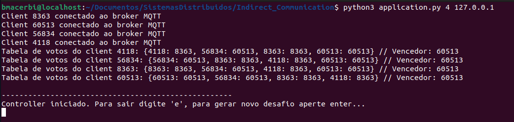
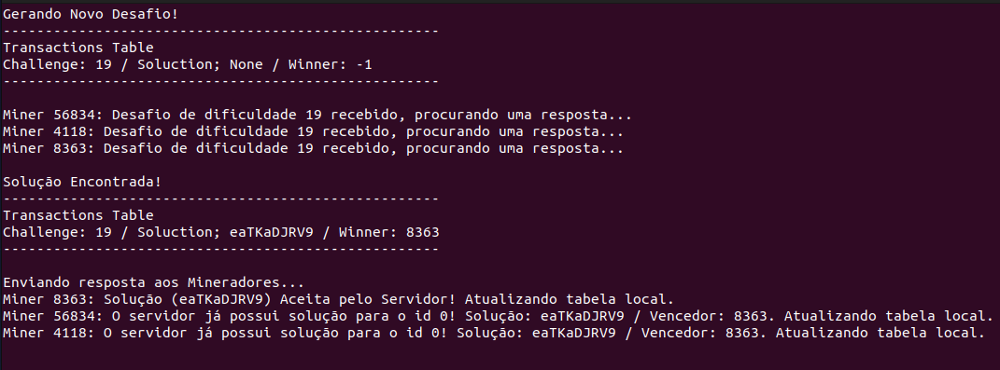

# Laboratório #6 -- Eleição e Coordenação Distribuída
## Integrantes: Bruno Menegaz, Gustavo Dutra, Leonardo Albergaria
---
## **Instruções para Compilação e Execução**

### **Inicializando Ambiente**

Para realizar a instalação, o primeiro passo é clonar o repositório para um diretório local e instalar o python em conjunto das bibliotecas utilizadas. Para realizar o download de todas as dependências, basta utilizando o seguinte comando:

```
$ pip3 install -r requirements.txt
```

Em sequência, é necessário realizar a instalação do broker *EMQX* caso deseje executar o projeto utilizando um broker local. Para isso basta acessar o link e seguir as instruções para o seu sistema operacional:

> https://www.emqx.com/en/try?product=broker

### **Execução**

Para realizar a execução do projeto, o primeiro passo é inicializar o *EMQX* caso você tenha feito a sua instalação. Para isso basta entrar com a seguinte linha de comando linux:

```
$ sudo emqx start
```

Em sequência, podemos inicializar a aplicação por meio da seguinte chamada, onde o <ip_do_broker> será **127.0.0.1** caso ele tenha sido instanciado localmente:

```
$ python3 application.py <número_de_clients> <ip_do_broker>
```

Por fim, caso queira finalizar o *EMQX* ao final da execução, podemos chamar o seguinte comando:

```
$ sudo emqx stop
```

---
## **Link para o vídeo no Youtube**

> https://youtu.be/8Gfp4N2vZuM

---
## **Implementação**

### **Application**

Inicializa os clientes e os conecta ao broker. A quantidade de clientes inicializados e o endereço do broker são passados como argumentos.

### **Client**

Define a classe Client. Cada client possui algumas variáveis importantes, como seu ID, uma lista de clientes conectados, a tabela de votos, o ID do controlador, etc.

Os métodos **_on_connect_** e **_on_message_** são chamados quando o cliente se conecta ao corretor MQTT e quando recebe uma mensagem, respectivamente. Ao se conectar, um cliente se inscreve nos tópicos **"sd/init"** e **"sd/voting"**. Ao receber uma mensagem, caso seja do tópico **init**, o cliente atualiza a lista de clientes conectados, e caso o mínimo de clientes já estejam conectados, a votação é iniciada. Caso a mensagem recebida seja do tópico **voting**, o cliente atualiza sua tabela de votos com o voto recebido.

O método **vote** é usado para gerar um voto aleatório e publicá-lo no tópico **"sd/voting"**. O voto é o ID de um dos clientes conectados. Já o método **countVote** conta os votos recebidos, determinando o vencedor. O ID do controlador é atualizado com o ID do cliente com mais votos.

Por fim, os métodos **startController** e **startMiner** instanciam o controlador e os mineradores, respectivamente. Um cliente é inicializado a partir de **runClient**, onde se conecta ao broker, publica uma mensagem em **"sd/init"** e então espera o resultado da eleição. Caso seja o vencedor, inicia um controlador, e caso contrário, um minerador. 

### **Controller**

O controlador é responsável por publicar os desafios, receber as soluções, validá-las e publicar os resultados.

Ao se conectar, o controlador se inscreve no tópico **"sd/solution"**, para receber as soluções enviadas pelos mineradores. 

O método **newChallenge** gera um novo desafio aleatório e o publica no tópico **"sd/challenge"** para que os mineradores possam participar. O método espera até que uma solução válida seja recebida.

Ao receber uma mensagem de solução, o controlador verifica se ela é válida. Se sim (e ainda não houver solução), ele publica uma mensagem de resultado e atualiza as informações da transação. Caso contrário, ele publica uma mensagem indicando que a solução é inválida.

### **Miner**

O minerador recebe os desafios do controlador, busca uma solução para aquele desafio e publica a solução encontrada.

Ao se conectar, o minerador se increve nos tópicos **"sd/challenge"** e **"sd/{self.id}/result"**, para receber os desafios e resultados das transações.

Ao receber uma mensagem de desafio, o minerador busca uma solução válida para ele, e ao encontrar, publica-a no tópico **"sd/solution"**. Caso a mensagem recebida seja de resultados, o minerador recebe o resultado de sua solução enviada e atualiza sua tabela de transações de acordo com as informações retornadas.

---
## **Resultados**

Para demonstrarmos alguns resultados da aplicação, resolvemos executar um ambiente com **4** clientes e um broker local. A partir daí, iremos exibir o comportamento do sistema, visto que aplicações gráficas não se encaixam bem nesse contexto.

Podemos dividir a execução do sistema em dois estágios, eleição e mineração. No primeiro momento os processos irão realizar uma votação para eleger um cliente controlador, podemos visualizar o resultado dessa votação na **Imagem 1**, onde cada cliente irá exibir uma lista com os votos de todos os participantes. Tais votos são computados e o **ID** com mais pontos é eleito o controlador.

> 

Visualiza-se no exemplo acima a exibição dessas listas, onde cada elemento representa um voto, sendo o primeiro **ID** do **votante** e o segundo **ID** do **votado**, sendo assim, a partir dessa execução, podemos chegar na seguinte tabela de eleição:

- Client **56834** recebeu 0 votos
- Client **4118** recebeu 0 votos
- Client **8363** recebeu 2 votos:
  - Dos clients **4118** e **8363**
- Client **60513** recebeu 2 votos
  - Dos clients **56834** e **60513**

Podemos ver que um empate ocorreu. Nesse caso escolhemos o cliente com maior ID como critério de desempate, dessa forma o processo **60513** foi eleito o controlador.

Prosseguimos agora para o segundo estado do sistema, a mineração, exibido na *imagem 2*. Visualizamos a primeira ação sendo do controlador, que é a exibição da tabela de desafios, nesse caso contendo **1** desafio de dificuldade **19**. Em sequência os mineradores irão receber a mensagem e iniciar a busca por uma solução.

Quando o desafio é solucionado, o controlador exibe a tabela atualizada com a solução enviada e o ID do vencedor. Nesse caso o ID que primeiro solucionou o problema foi o cliente **8363**, com a respota **eaTKaDJRV9**. Em sequência, publica-se a mensagem que o desafio foi solucionado e os mineradores irão atualizar as suas tabelas própias, contabilizando uma vitória ou uma derrota. 

> 

A partir desse estágio, podemos prosseguir postando mais desafios ou sair da aplicação com o caractere 'e'.

## **Conclusão**
